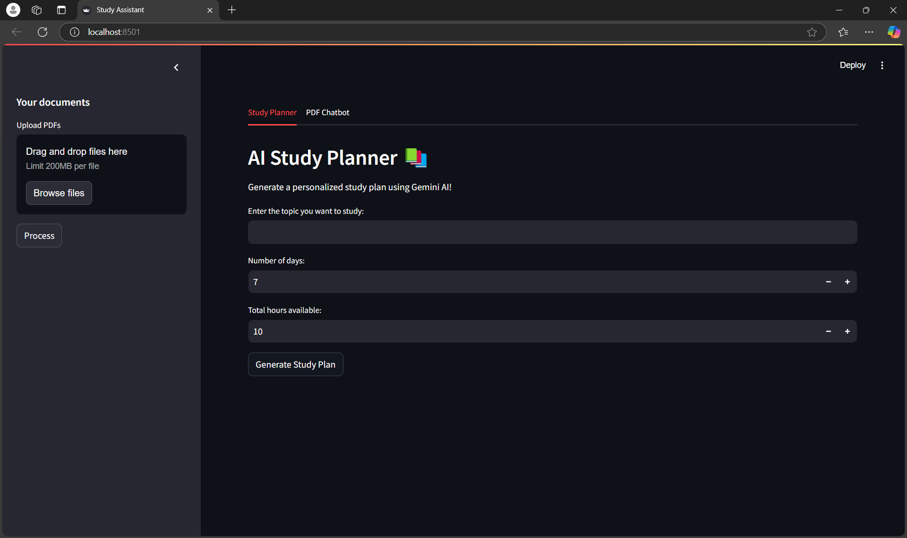
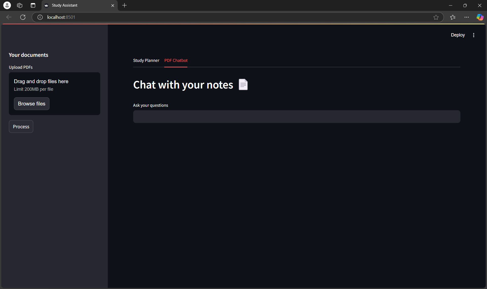

# StudBud: AI-Powered Study Planner

StudBud is an AI-powered study planner designed to help students create personalized, actionable, and time-efficient study plans. With features like AI-generated study plans and a PDF Chatbot, StudBud makes studying smarter and more organized.

---

## Features

1. AI Study Planner:

   - Generates personalized study plans based on the user's topic, available hours, and deadlines.

    - Breaks down the study plan into daily tasks with time allocations.

1. PDF Chatbot:

    - Allows users to upload study materials (e.g., PDFs) and ask questions.

    - Provides accurate, context-aware answers based on the uploaded content.

1. User-Friendly Interface:

    - Built with Streamlit for a seamless and intuitive experience.

    - Clean, modern design with custom HTML/CSS templates.

1. Export Options:

    - Download study plans as PDF for offline use.

    - Share study plans via email.

1. Technology Stack
    - Frontend: Streamlit (Python)

    - Backend: Python

    - AI/ML:

        - Google Gemini API (for study plan generation and chatbot functionality)

        - LangChain (for managing prompts and interactions)

    - Libraries:

       ` google-generativeai`, `PyPDF2`, `FAISS`, `fpdf`, `reportlab`, `smtplib`

    - Styling: Custom HTML/CSS templates

---

## Installation
### Prerequisites
---
Python 3.8 or higher

A Google API key for Gemini (set up in Google AI Studio)

### Steps
1. Clone the repository:
    ```bash
    git clone https://github.com/your-username/studbud.git
    cd studbud
    ```

1. Install the required dependencies:
    ```bash
    pip install -r requirements.txt
    ```
1. Create a .env file in the root directory and add your Google API key:
    ```
    GEMINI_API_KEY=your_api_key_here
    ```
1. Run the app:
    ```
    streamlit run app.py
    ```
1. Open your browser and navigate to `http://localhost:8501`.

---

## Usage
1. AI Study Planner
    - Enter the topic you want to study.

    - Specify the number of days and total hours available.

    - Click Generate Study Plan to create a personalized study schedule.

2. PDF Chatbot
    - Upload study materials (e.g., PDFs).

    - Ask questions about the content, and the chatbot will provide answers.

3. Export Options
    - Download as PDF: Click the Download Study Plan as PDF button to save the study plan.

    - Share via Email: Enter the recipient's email address to share the study plan.

---

## Screenshot

### Study Planner

### PDF Chat


---

## Future Enhancements
- Progress Tracking: Allow users to track their progress and adjust plans dynamically.

- Calendar Integration: Sync study plans with Google Calendar or Outlook.

- Mobile App: Develop a mobile version for on-the-go access.

- Multilingual Support: Add support for multiple languages.

## Acknowledgments
- __Google Gemini API__ for powering the AI features.

- __Streamlit__ for the intuitive web interface.

- __LangChain__ for managing prompts and interactions.